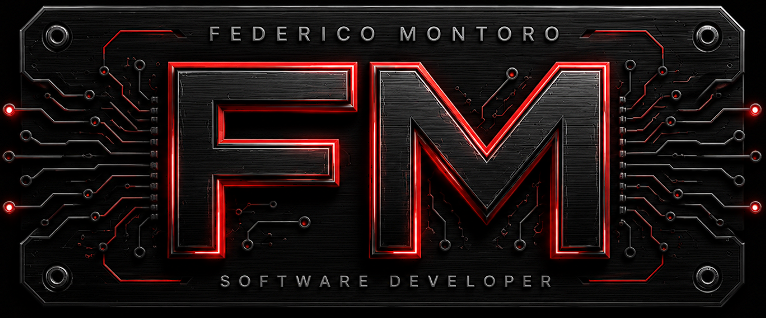

<div align="right">

[🇺🇸 English](./README.md) | [🇦🇷 Español](./README.es.md)

</div>

<div align="center">

# Federico Montoro

### Full-Stack Developer • Process Analysis • Automation



### 🌐 Live Portfolio

https://fedemontoro.vercel.app/

---

*"Technology is only valuable when it helps people solve real problems."*

</div>

---

# About

This repository contains the source code of my personal portfolio.

The objective of this project is not only to present my professional background, but also to showcase my way of thinking, designing and developing digital solutions.

The website is available in both **Spanish** and **English**, includes responsive design, dark/light mode and direct access to my projects.

---

# Features

- 🇪🇸 Spanish / 🇺🇸 English
- 🌙 Dark & Light Theme
- 📱 Responsive Design
- 📄 Automatic CV download according to selected language
- 💼 Professional experience
- 🎓 Education
- 🧠 About Me
- 🚀 Featured Projects
- 📬 Contact Form
- 🔗 Direct access to FTK Lab

---

# Featured Project

## FTK Lab

A digital solutions laboratory focused on creating useful software for professionals, businesses and SMEs.

Main services include:

- Web Development
- Process Digitalization
- Business Automation
- Internal Management Systems
- Back Office Tools

Visit:

https://ftk-lab.vercel.app/

---

# Technologies

- HTML5
- CSS3
- JavaScript
- Responsive Design
- Vercel
- Git
- GitHub

---

# Project Structure

```text
assets/
│
├── branding/
├── backgrounds/
├── cv/
├── icons/
├── images/
└── flags/

css/

js/

index.html
```

---

# Screenshots

## Home

> Modern landing page with bilingual navigation.

## About

> Human profile combined with technology.

## Experience

> Professional background and technical skills.

## FTK Lab

> Direct access to my software laboratory.

## Contact

> Contact form with language support.

---

# CV

The portfolio automatically downloads the correct resume depending on the selected language.

Spanish

```
CV - ES
```

English

```
CV - EN
```

---

# Contact

**Federico Montoro**

Full-Stack Developer

Portfolio

https://fedemontoro.vercel.app/

GitHub

https://github.com/Frederick1824

FTK Lab

https://ftk-lab.vercel.app/

---

# Philosophy

> Small laboratory.
>
> Big solutions.

---

<div align="center">

Made with ❤️ by Federico Montoro

Powered by FTK Lab

</div>
